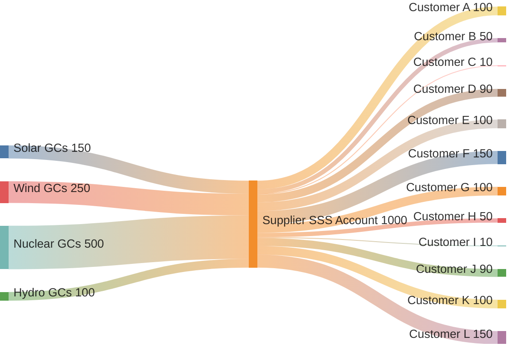

# Using Subaccounts to Allocate Retired GCs to Your Customers

Welcome to this user guide on the Granular Registry's subaccount feature! This tool helps suppliers and utilities like you easily manage and share retired Granular Certificates (GCs) with your customers. GCs are digital records that prove renewable energy was generated at specific times, helping businesses track their green energy use. By using subaccounts, you can assign these certificates to individual customers in a clear, secure way. This guide provides a step-by-step walkthrough of how it works, highlighting key benefits for both your business and your customers.

### Why Use Subaccounts? The Benefits

Subaccounts make managing renewable energy certificates simpler and more efficient. Here's what you gain:

* **Easier Customer Management**: Quickly assign GCs to specific customers without complicated transfers, saving you time and reducing paperwork.
* **Better Transparency and Trust**: Everything is tracked and auditable, so your customers can see exactly where their green energy comes from, building stronger relationships.
* **Compliance Made Simple**: Helps customers meet reporting requirements for things like carbon emissions tracking (e.g., under standards like GHG Protocol or RE100), making your services more valuable.
* **Avoid Mistakes**: Prevents double-counting or errors, ensuring accurate claims for renewable energy use.
* **Business Growth**: Offer premium services like time-matched green energy, which can attract more customers and allow for higher pricing.
* **Scalability**: Handle multiple customers effortlessly as your business grows, all from one main account.

In short, subaccounts turn complex certificate handling into a straightforward process that boosts your efficiency and customer satisfaction.

### Key Terms to Know

* **Main Account (Your Supplier Account)**: This is your central hub where all retired GCs first arrive. Think of it as your main storage for certificates from sources like solar or wind.
* **Subaccounts**: These are like dedicated folders under your main account, one for each customer. You move GCs into them to assign to that customer.
* **Retired GCs**: Certificates that are "used up" and can't be traded anymore—they're ready for customers to claim for their energy use.
* **Allocation**: The process of moving GCs from your main account to a customer's subaccount based on your agreements.

### How to Use Subaccounts: Step-by-Step

The feature works like a flow of certificates from energy sources into your account, then out to customers. The diagram below shows an example of how GCs move:

#### 1. Add GCs to Your Main Account

* When renewable energy is generated (e.g., from solar panels or wind turbines), GCs are created and retired in your main account.
* In the example diagram, GCs come from different sources: 150 from solar, 250 from wind, etc., totaling 1,000 units.
* **Tip**: Use the Registry dashboard to upload or integrate data automatically from energy providers. This ensures all details—like time, location, and environmental impact—are included.

#### 2. Create Subaccounts for Customers

* Log into your Registry account and go to the "Subaccounts" section.
* Click "Create New Subaccount" and enter details like the customer's name and a unique ID (e.g., "Customer A").
* You control access: Give customers view-only permissions so they can check their GCs without making changes.
* **Benefit**: This setup keeps everything organized and secure, like giving each customer their own locked drawer in your filing cabinet.

#### 3. Allocate GCs to Subaccounts

* Select GCs from your main account (you can choose based on source, amount, or rules like "first in, first out").
* Move them to the right subaccount via the dashboard or API—for example, assign 100 units to Customer A.
* In the diagram, the total GCs (1,000) are split among 12 customers, matching their needs.
* Once allocated, it's permanent and tracked, so no worries about changes later.
* **Benefit**: Custom allocations let you match customer preferences, like giving more low-carbon options to eco-focused clients.

#### 4. Manage and Report After Allocation

* Customers can log in to view their subaccount and download reports showing their GCs and benefits (e.g., reduced emissions).
* You can pull overall reports from your main account to see everything at a glance.
* **Tip**: Set up automatic quarterly reports to keep everyone updated effortlessly.
* **Benefit**: Easy reporting helps customers with their sustainability goals, making your service stand out.

### Tips for Success

* Start small: Test with one or two customers to get comfortable.
* Customize rules: Decide how to split GCs (e.g., by energy type) based on your contracts.
* Stay secure: All data is encrypted, and changes are logged for peace of mind.
* If you need help: Check the Registry help center or contact support for setup guidance.

### Real-World Example

Imagine you're a utility supplier with 1,000 retired GCs from mixed sources, as in the diagram. You have a data center customer (Customer F) who needs reliable green energy. You allocate 150 units to their subaccount, focusing on steady sources like nuclear. Every quarter, they get an auto-report for their environmental filings. This keeps them happy, compliant, and loyal—while you save time on manual tracking.

Ready to get started? Log in to the Granular Registry today and create your first subaccount. If you have questions, our team is here to help!
